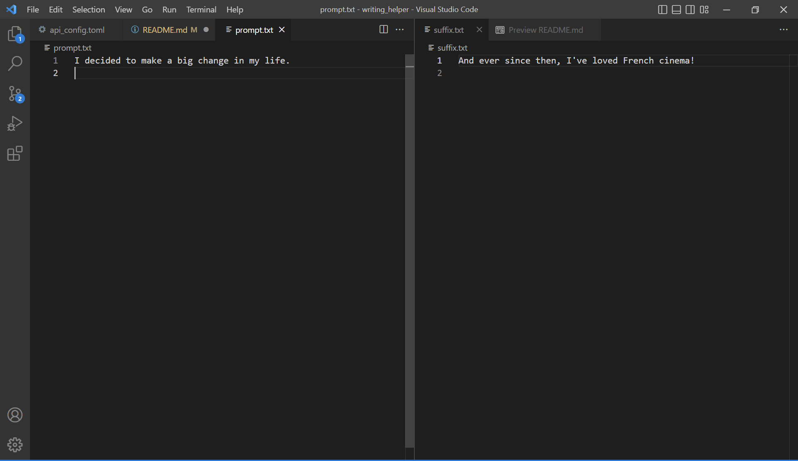
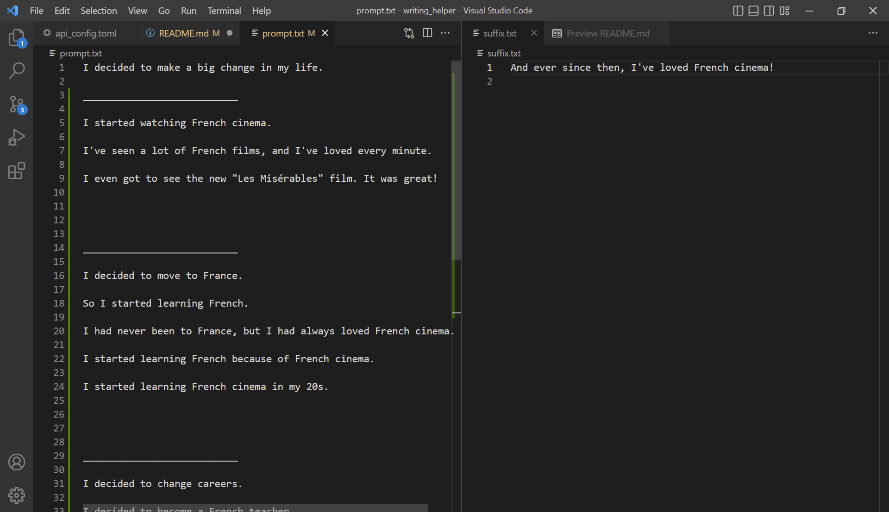

# writing_helper

Generate GPT-3 text completions quickly using an executable wrapper for the OpenAI GPT-3 Completions API, two text files, and a config file.

This tool requires the user to have their own OpenAI api key stored as an environment variable with the default name "OPEN_API_ACCESS_KEY". The environment variable name can be modified in the api_config.toml configuration file.

You are responsible to adhering to OpenAI's Terms of Use (see below).

## Install

### Binaries

None included yet.

### Building from source

Run

```shell
git clone https://github.com/justinluther502/writing_helper.git
cd writing_helper
cargo build --release
```

to run the application, drop the following 4 files anywhere in the same directory:

- prompt.txt
- suffix.txt
- api_config.toml
- writing_helper exectuable

Then enter a prompt in prompt.txt, and an optional suffix. 



Run the executable, and upon completion, a few choices of GPT-3 generated completions should be inserted into prompt.txt, along with the optional suffix. Pick what you like, and iterate until you have the content you want!



### Run via Cargo from repository root

You can also run directly from the repository directory using the root files and running

```shell
cargo run
```

## Compliance

Please refer to the OpenAI Terms of Use. This tool requires using your own API key.

https://openai.com/api/policies/terms/
